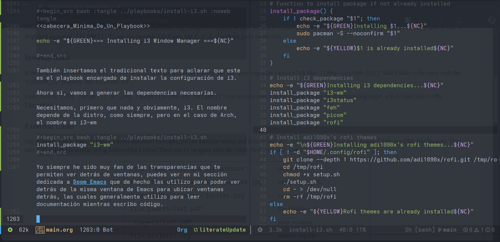

#+title: PersonalDotFiles
#+author: mrtaichi

* Introducción
Bienvenido a mis dotfiles de uso personal! En este repositorio puedes encontrar todas las dotfiles que utilizo para mi flujo de trabajo en mi día a día. Espero que vayan evolucionando a lo largo del tiempo, conforme mis formas de trabajar vayan evolucionando a lo largo de los años. Aunque también espero que, eventualmente, lleguemos a una versión final, ya que eso sería señal de una metodología de trabajo curada y terminada.

** Acerca del estilo de este repositorio
En este repositorio vas a encontrar varias cosas -obviamente mis dotfiles-, pero todas nacen en esencia de este documento que estás leyendo.

Todas mis dotfiles nacen de este documento, pues mis dotfiles, para cuando termine de hacer este documento, están hechas usando el paradigma de programación Literate Programming.

*** Qué es el Literate Programming? O Programación Letrada, en español.
La programación letrada es un paradigma -o estilo- de programación propuesto por Donald Knuth allá por el año de 1984 en el paper homónimo publicado por él. Este estilo de programación tiene muchas implicaciones muy bonitas, por lo que lo mejor sería que fueras a leer el paper que te comento, así que a grosso modo lo que te puedo decir es que, bajo este estilo de programación, la documentación y el código nacen de la misma fuente: un archivo /tangleable/ (compilable a código) y /weaveable/ (compilable a documentación) que combina ambas cosas en una sola.
Esto nos ofrece de ventaja que nuestros programas prácticamente se autodocumentan, pues al estarlos realizando deberemos de cambiar nuestro set mental a escribir el *por qué* de lo que estamos haciendo a la par que lo hacemos. Esto nos ahorra el "voy a documentar después" al que muchas personas caen cuando están realizando un proyecto de programación. Y además, hay que considerar que muchas veces nuestro código será leído por humanos más veces de lo que será leído por la máquina, entonces debemos de pensar en realizarlo no para la máquina, si no para estos humanos.

*** Implementación en este proyecto.
Para seguir el estilo de programación dicho anteriormente en este proyecto, he decidio hacerlo utilizando org-mode, el cual es un sistema para editar, formatear y organizar documentos dentro de Emacs. Este sistema, mediante algunos plugins, puede -y de manera bastante poderosa- utilizarse para escribir "programas letrados".

** Acerca de la estructura de este repositorio
Podemos segmentar en este proyecto tres partes principales, las cuales son:

*** Parte letrada
Todos los archivos .org que se encuentran bajo la carpeta docs son la parte realmente viva de este proyecto, pues es la parte letrada de la que emanan las otras dos partes de este proyecto.
Estos son archivos en donde iré explicando mis dotfiles, parte por parte y de manera detallada, para que se entienda cada decisión de diseño y linea de código que escriba en los mismos. A opinión personal, si eres un visitante de este repositorio, quisiera exhortarte a que instales Emacs e intentes leer este proyecto utilizando esta parte, pues considero que es la mejor forma de entender y utilizar este proyecto de un solo vistazo. Esta parte, al puro estilo del estilo de programación bajo el que se crea este proyecto, es compilable al código final y a la documentación. Es la parte maestra y sobre la que realizaré todas las modificaciones y explicaciones necesarias. Viendose reflejado esto en el resto de las partes, pero como un efecto secundario de la modificación bajo esta parte.

*** Parte documentación
El archivo PDF que vive bajo docs, el cual es la documentación autogenerada de todo el proyecto.

*** Parte código (dotfiles)
Las dotfiles mismas, las cuales son generadas automáticamente a partir de la parte letrada. Son la parte realmente usable por la computadora, pero la parte de este proyecto menos hecha para ser leída por el humano. Por la naturaleza de este proyecto, la parte de código no contiene ni un solo comentario dentro de sí, toda cosa que se le tenga que decir al humano que está leyendo el código se le va a decir en las otras dos partes.

** Recomendación personal para leer este repositorio.
Para entender realmente este repositorio, la mejor forma siempre va a ser mediante su parte letrada y bajo el entorno de trabajo que pueda exprimir esta parte letrada al máximo. Para lograr esto, mi recomendación es que, si eres nuevo en esto de la programación letrada, realices lo siguiente:

- Instala Emacs
- Instala Doom Emacs
- Carga mis dotfiles de Emacs, las cuales (obviamente) están diseñadas para poder cargar la parte letrada de este repositorio y consultarla.

Para estos pasos puedes encontrar instrucciones bajo este mismo repositorio y archivo.


* Playbooks

Los playbooks son scripts de instalacion modulares para los diferentes componentes de mis dotfiles. Cada herramienta de este proyecto está ligada a un playbook, y cada playbook tiene como objetivos lo siguiente:

- Instalar la herramienta en cuestión, junto con sus dependencias
- Cargar los dotfiles respectivos que va a consumir la herramienta.

Esto nos ofrece una forma más rápida y eficiente de cargar mis dotfiles en un nuevo equipo. A cada una de las herramientas que vaya a configurar en este proyecto le va a corresponder un playbook que iré definiendo conforme vayamos pasando por el capítulo dedicado a dicha herramienta del libro. Pero antes de comenzar con ello, quiero definir algunas cosillas que voy a estar utilizando todo el tiempo en todos los playbooks, algo así como la plantilla base de cosas que me han funcionado en todos los playbooks que había creado antes de migrar mis dotfiles a programación letrada.

** Cabecera común de un playbook

La cabecera más común para todos los playbooks del proyecto es la siguiente:

#+NAME: cabecera_Minima_De_Un_Playbook
#+begin_src bash :noweb tangle
<<shebang_de_Bash>>

<<exit_On_Error>>

<<colores_Default_Playbook>>

<<funcion_Para_Verificar_Si_Un_Paquete_Esta_Instalado>>

<<funcion_Para_Instalar_Un_Paquete>>

<<funcion_Para_Crear_Backup_De_Un_Archivo_Existente>>

<<funcion_Para_Crear_Un_Enlace_Simbolico>>

#+end_src

Esto nos da varias de las funcionalidades comunes que necesitaremos en todos los playbooks para comenzar a hacerlos útiles. A continuación, vamos a concretarlas todas.

*** Shebang

Todos los playbooks son scripts hechos en bash, porque es casi que lo único que tenemos garantizado en un equipo Linux virgen. Para hacerlos ejecutables, necesitamos definirle a Linux mediante un shebang que son archivos ejecutables por bash.

#+NAME: shebang_Bash
#+begin_src bash
#!/bin/bash
#+end_src

*** Exit on Error

Los playbooks van a estar cambiando configuraciones del equipo, así que por definición, son scripts delicados. Nos interesa entonces que, si ocurre un error en cualquiera de los pasos, por mínimo que sea, el script detenga su ejecución y no siga más. Esto lo podemos hacer con /set -e/.

#+NAME: exit_On_Error
#+begin_src bash
set -e
#+end_src

*** Colores

Para que quede bonita la salida de los playbooks :3

#+NAME: colores_Default_Playbook
#+begin_src bash
RED='\033[0;31m'
GREEN='\033[0;32m'
YELLOW='\033[1;33m'
NC='\033[0m' # No Color
#+end_src

*** Verificar si un paquete está instalado
Nos queremos ahorrar las instalaciones manuales de las dependencias necesarias para una herramienta -y la instalación de la herramienta en sí- lo más posible, por lo que queremos que nuestros playbooks posean la funcionalidad necesaria para ahorrarnos esto, trabajando con el gestor de paquetes de nuestra distribución siempre que sea posible.

Primero, para ahorrarnos ciertos edge cases, crearemos una función que verifique con nuestro gestor de paquetes si el paquete dado se encuentra ya instalado.

#+NAME: funcion_Para_Verificar_Si_Un_Paquete_Esta_Instalado
#+begin_src bash
check_package() {
    if pacman -Qi "$1" &>/dev/null; then
        return 0
    else
        return 1
    fi
}
#+end_src

Cabe decir que debido a que uso Arch (btw) esta función y la siguiente están acomodadas para pacman, que es el gestor de paquetes que usa esta distro. Si en un futuro cambio de gestor de paquetes, debería de ser relativamente sencillo ajustar todo, cambiando la definición de esta función y la siguiente.

*** Instalar un paquete
Luego, vamos a crear un pequeño wrap para pacman (o el gestor de paquetes que nos toque en el futuro) para instalar paquetes automáticamente.

#+NAME: funcion_Para_Instalar_Un_Paquete
#+begin_src bash
install_package() {
    if ! check_package "$1"; then
        echo -e "${GREEN}Installing $1...${NC}"
        sudo pacman -S --noconfirm "$1"
    else
        echo -e "${YELLOW}$1 is already installed${NC}"
    fi
}
#+end_src

*** Crear backup de un archivo existente

#+NAME: funcion_Para_Crear_Backup_De_Un_Archivo_Existente
#+begin_src bash
backup_file() {
    if [ -e "$1" ]; then
        echo -e "${YELLOW}Backing up $1 to $1.bak${NC}"
        mv "$1" "$1.bak"
    fi
}
#+end_src

*** Crear enlaces simbólicos

No vamos a copiar los archivos de configuración a sus respectivos lugares según la herramienta, porque eso nos obligaría a modificarlos individualmente cada vez que actualicemos estas configuraciones. En su lugar, vamos a crear enlaces simbólicos del lugar en el que deberían de estar hacia nuestra configuración en el repositorio del proyecto.

#+NAME: funcion_Para_Crear_Un_Enlace_Simbolico
#+begin_src bash
create_symlink() {
    local source="$1"
    local target="$2"

    # Create target directory if it doesn't exist
    local target_dir=$(dirname "$target")
    if [ ! -d "$target_dir" ]; then
        echo -e "${YELLOW}Creating directory: $target_dir${NC}"
        mkdir -p "$target_dir"
    fi

    echo -e "${GREEN}Creating symlink: $target -> $source${NC}"
    backup_file "$target"
    ln -sf "$source" "$target"
}
#+end_src


* Doom Emacs

Si todo este proyecto utiliza programación letrada, es imperativo que las primeras dotfiles que se creen sean las necesarias para hacer mi entorno de trabajo de programación letrada. Entonces comencemos con la herramienta principal, la cual es Doom Emacs. Si estás leyendo este documento en org, abajo verás el enlace al archivo org de toda esta herramienta, si estás leyendo PDF... pues sigue leyendo lol.

** Introducción
Doom Emacs es mi principal editor de texto. Emacs en sí es el editor de texto que llevo usando desde que inicié la carrera -por influencia de la cultura de mi facultad-. El problema con Emacs es que es, a mi gusto, difícil de configurar en su versión básica. Por esto decidí usar Doom Emacs, el cual es un framework de configuración que me sirve para tener todo el poder de Emacs de una manera sencilla y que, además, no me hace perder la configurabilidad que me provee un Emacs vainilla.


** Instalación
Vamos a generar un playbook para poder instalar doom emacs de manera sencilla en cualquier dispositivo que vaya a utilizar.
De base necesitamos Emacs vanilla, el cual, tenemos la gran suerte de que existe en los repositorios de casi cualquier distribución de Linux que exista. A la fecha no conozco una distro de linux que no lo incluya.
Comenzamos importando la cabecera mínima del playbook y un pequeño mensaje al usuario para indicarle que este es el playbook para instalar Doom Emacs.

#+begin_src bash :tangle ../playbooks/install-doom-emacs.sh :noweb tangle
<<cabecera_Minima_De_Un_Playbook>>

echo -e "${GREEN}=== Installing Doom Emacs ===${NC}"

#+end_src

*** Instalación de dependencias

Según la página de instalación de Doom Emacs, las dependencias requeridas para Doom Emacs son:
#+begin_quote
- **Required:**
  - GNU Emacs 27.1–30.2
    - 30.2 is recommended (fastest and most stable)
    - Doom's modules require >=28.1
      - Tree-sitter support requires >= 29.1
      - JS(X)/TS(X) support is far better on >= 30.1 (w/ tree-sitter)
    - Doom's core requires >=27.1
  - Git >= 2.23
  - [ripgrep] >= 11.0
- **Optional, but recommended:**
  - [fd] 7.3.0+ (used to improve file indexing performance)
  - GNU variants of `find`, `ls`, and `tar` (on MacOS and BSD *nix)
  - Symbola font (Emacs' fallback font for glyphs it can't display)
#+end_quote

Quiero de inmediato obviar el tema de las versiones, porque uso Arch (btw) y, por ser rolling release, en la mayoría e los casos el upstream de esta distro suele tener siempre las versiones más recientes de los paquetes; por lo que en muy raros casos vamos a necesitar alguna versión distinta a la del upstream.

Luego, obviamos inmediatamente las "GNU Variants" porque por tener Linux ya las tenemos, idem con la symbola font que en la mayoría de los casos la solemos tener, y de todas formas es una fuente fallback.

Nos quedamos entonces con:
- Emacs
- Git
- Ripgrep
- Fd

Hacemos nuestra tarea para buscar los nombres de los paquetes para nuestra distribución, los cuales son los siguientes:

- Emacs = emacs
- Git = git
- Ripgrep = ripgrep
- Fd = fd

Dicho esto, podemos instalar los requerimentos usando las funciones definidas en la cabecera de nuestros playbooks. Lo agregamos al playbook:

#+begin_src bash :tangle ../playbooks/install-doom-emacs.sh :noweb tangle :eval never

echo -e "${GREEN}Installing Doom Emacs dependencies...${NC}"
install_package "emacs"
install_package "git"
install_package "ripgrep"
install_package "fd"

#+end_src

*** Instalación de la herramienta

Una vez instaladas las dependencias, podemos comenzar a prepararnos para instalar todo lo necesario. Las instrucciones para instalar Doom Emacs en el repositorio son las siguientes:
#+begin_quote
# Install
``` sh
git clone --depth 1 https://github.com/doomemacs/doomemacs ~/.config/emacs
~/.config/emacs/bin/doom install
```

Then [read our Getting Started guide][getting-started] to be walked through
installing, configuring and maintaining Doom Emacs.

It's a good idea to add `~/.config/emacs/bin` to your `PATH`! Other `bin/doom`
commands you should know about:

+ `doom sync` to synchronize your private config with Doom by installing missing
  packages, removing orphaned packages, and regenerating caches. Run this
  whenever you modify your private `init.el` or `packages.el`, or install/remove
  an Emacs package through your OS package manager (e.g. mu4e or agda).
+ `doom upgrade` to update Doom to the latest release & all installed packages.
+ `doom doctor` to diagnose common issues with your system and config.
+ `doom env` to dump a snapshot of your shell environment to a file that Doom
  will load at startup. This allows Emacs to inherit your `PATH`, among other
  things.

#+end_quote

Las instrucciones las podemos resumir a:
- Clonar el repositorio en el directorio de configuraciones de emacs (generalmente, y en mi caso particular, .config/...)
- Corremos el binario doom install que vendría en el contenido que acabamos de clonar.

#+begin_src bash :tangle ../playbooks/install-doom-emacs.sh :eval never
echo -e "\n${GREEN}Installing Doom Emacs...${NC}"
if [ ! -f "$HOME/.config/emacs/bin/doom" ]; then
    git clone --depth 1 https://github.com/doomemacs/doomemacs "$HOME/.config/emacs"
    "$HOME/.config/emacs/bin/doom" install
else
    echo -e "${YELLOW}Doom Emacs is already installed${NC}"
fi

#+end_src

*** Carga de configuraciones

Una vez instalado Doom Emacs, podemos comenzar a importar las configuraciones incluídas en este repositorio.

Para esto creamos los enlaces simbólicos respectivos.

#+begin_src bash :tangle ../playbooks/install-doom-emacs.sh :eval never
SCRIPT_DIR="$(cd "$(dirname "${BASH_SOURCE[0]}")" && pwd)"
REPO_ROOT="$(dirname "$SCRIPT_DIR")"

echo -e "\n${GREEN}Installing Doom Emacs config...${NC}"
create_symlink "$REPO_ROOT/doomEmacs/config.el" ~/.config/doom/config.el
create_symlink "$REPO_ROOT/doomEmacs/init.el" ~/.config/doom/init.el
create_symlink "$REPO_ROOT/doomEmacs/packages.el" ~/.config/doom/packages.el

#+end_src

Doom Emacs provee un mecanismo de "sincronización" el cual debemos correr cada vez que modifiquemos los archivos de configuración, para que estos cambios surtan efecto.

#+begin_src bash :tangle ../playbooks/install-doom-emacs.sh :eval never
echo -e "\n${GREEN}Syncing Doom Emacs...${NC}"
"$HOME/.config/emacs/bin/doom" sync

echo -e "\n${GREEN}=== Doom Emacs Installation Complete ===${NC}"
echo -e "${YELLOW}Note: You may need to restart Emacs for all changes to take effect.${NC}"

#+end_src


** init.el

#+begin_quote
Where you’ll find your doom! block, which controls what Doom modules are enabled and in what order they will be loaded.
This file is evaluated early when Emacs is starting up; before any other module has loaded. You generally shouldn’t add code to this file unless you’re targeting Doom’s CLI or something that needs to be configured very early in the startup process.
#+end_quote

En este archivo seleccionamos los /doom modules/ que vamos a necesitar para el flujo de trabajo. Siendo la lista original la siguiente:

#+begin_src lisp :eval never
;;; init.el -*- lexical-binding: t; -*-

;; This file controls what Doom modules are enabled and what order they load
;; in. Remember to run 'doom sync' after modifying it!

;; NOTE Press 'SPC h d h' (or 'C-h d h' for non-vim users) to access Doom's
;;      documentation. There you'll find a link to Doom's Module Index where all
;;      of our modules are listed, including what flags they support.

;; NOTE Move your cursor over a module's name (or its flags) and press 'K' (or
;;      'C-c c k' for non-vim users) to view its documentation. This works on
;;      flags as well (those symbols that start with a plus).
;;
;;      Alternatively, press 'gd' (or 'C-c c d') on a module to browse its
;;      directory (for easy access to its source code).

(doom! :input
       ;;bidi              ; (tfel ot) thgir etirw uoy gnipleh
       ;;chinese
       ;;japanese
       ;;layout            ; auie,ctsrnm is the superior home row

       :completion
       ;;(company +childframe)           ; the ultimate code completion backend
       ;;helm              ; the *other* search engine for love and life
       ;;ido               ; the other *other* search engine...
       ;;ivy               ; a search engine for love and life
       ;;vertico           ; the search engine of the future

       :ui
       ;;deft              ; notational velocity for Emacs
       ;;doom              ; what makes DOOM look the way it does
       ;;doom-dashboard    ; a nifty splash screen for Emacs
       ;;doom-quit         ; DOOM quit-message prompts when you quit Emacs
       ;;(emoji +unicode)  ; 🙂
       ;;hl-todo           ; highlight TODO/FIXME/NOTE/DEPRECATED/HACK/REVIEW
       ;;hydra
       ;;indent-guides     ; highlighted indent columns
       ;;ligatures         ; ligatures and symbols to make your code pretty again
       ;;minimap           ; show a map of the code on the side
       ;;modeline          ; snazzy, Atom-inspired modeline, plus API
       ;;nav-flash         ; blink cursor line after big motions
       ;;neotree           ; a project drawer, like NERDTree for vim
       ;;ophints           ; highlight the region an operation acts on
       ;;(popup +defaults)   ; tame sudden yet inevitable temporary windows
       ;;tabs              ; a tab bar for Emacs
       ;;treemacs          ; a project drawer, like neotree but cooler
       ;;unicode           ; extended unicode support for various languages
       ;;(vc-gutter +pretty) ; vcs diff in the fringe
       ;;vi-tilde-fringe   ; fringe tildes to mark beyond EOB
       ;;window-select     ; visually switch windows
       ;;workspaces        ; tab emulation, persistence & separate workspaces
       ;;zen               ; distraction-free coding or writing

       :editor
       ;;file-templates    ; auto-snippets for empty files
       ;;fold              ; (nigh) universal code folding
       ;;(format +onsave)  ; automated prettiness
       ;;god               ; run Emacs commands without modifier keys
       ;;lispy             ; vim for lisp, for people who don't like vim
       ;;multiple-cursors  ; editing in many places at once
       ;;objed             ; text object editing for the innocent
       ;;parinfer          ; turn lisp into python, sort of
       ;;rotate-text       ; cycle region at point between text candidates
       ;;snippets            ; my elves. They type so I don't have to
       ;;(evil +everywhere)
       ;;word-wrap         ; soft wrapping with language-aware indent

       :emacs
       ;;dired             ; making dired pretty [functional]
       ;;electric          ; smarter, keyword-based electric-indent
       ;;ibuffer         ; interactive buffer management
       ;;undo              ; persistent, smarter undo for your inevitable mistakes
       ;;vc                ; version-control and Emacs, sitting in a tree

       :term
       ;;eshell            ; the elisp shell that works everywhere
       ;;shell             ; simple shell REPL for Emacs
       ;;term              ; basic terminal emulator for Emacs
       ;;vterm             ; the best terminal emulation in Emacs

       :checkers
       ;;syntax              ; tasing you for every semicolon you forget
       ;;(spell +flyspell) ; tasing you for misspelling mispelling
       ;;grammar           ; tasing grammar mistake every you make

       :tools
       ;;ansible
       ;;biblio            ; Writes a PhD for you (citation needed)
       ;;collab            ; buffers with friends
       ;;debugger          ; FIXME stepping through code, to help you add bugs
       ;;direnv
       ;;docker
       ;;editorconfig      ; let someone else argue about tabs vs spaces
       ;;ein               ; tame Jupyter notebooks with emacs
       ;;(eval +overlay)     ; run code, run (also, repls)
       ;;lookup              ; navigate your code and its documentation
       ;;lsp               ; M-x vscode
       ;;magit             ; a git porcelain for Emacs
       ;;make              ; run make tasks from Emacs
       ;;pass              ; password manager for nerds
       ;;pdf               ; pdf enhancements
       ;;prodigy           ; FIXME managing external services & code builders
       ;;rgb               ; creating color strings
       ;;taskrunner        ; taskrunner for all your projects
       ;;terraform         ; infrastructure as code
       ;;tmux              ; an API for interacting with tmux
       ;;tree-sitter       ; syntax and parsing, sitting in a tree...
       ;;upload            ; map local to remote projects via ssh/ftp

       :os
       ;;(:if (featurep :system 'macos) macos)  ; improve compatibility with macOS
       ;;tty               ; improve the terminal Emacs experience

       :lang
       ;;agda              ; types of types of types of types...
       ;;beancount         ; mind the GAAP
       ;;(cc +lsp)         ; C > C++ == 1
       ;;clojure           ; java with a lisp
       ;;common-lisp       ; if you've seen one lisp, you've seen them all
       ;;coq               ; proofs-as-programs
       ;;crystal           ; ruby at the speed of c
       ;;csharp            ; unity, .NET, and mono shenanigans
       ;;data              ; config/data formats
       ;;(dart +flutter)   ; paint ui and not much else
       ;;dhall
       ;;elixir            ; erlang done right
       ;;elm               ; care for a cup of TEA?
       ;;emacs-lisp        ; drown in parentheses
       ;;erlang            ; an elegant language for a more civilized age
       ;;ess               ; emacs speaks statistics
       ;;factor
       ;;faust             ; dsp, but you get to keep your soul
       ;;fortran           ; in FORTRAN, GOD is REAL (unless declared INTEGER)
       ;;fsharp            ; ML stands for Microsoft's Language
       ;;fstar             ; (dependent) types and (monadic) effects and Z3
       ;;gdscript          ; the language you waited for
       ;;(go +lsp)         ; the hipster dialect
       ;;(graphql +lsp)    ; Give queries a REST
       ;;(haskell +lsp)    ; a language that's lazier than I am
       ;;hy                ; readability of scheme w/ speed of python
       ;;idris             ; a language you can depend on
       ;;json              ; At least it ain't XML
       ;;(java +lsp)       ; the poster child for carpal tunnel syndrome
       ;;javascript        ; all(hope(abandon(ye(who(enter(here))))))
       ;;julia             ; a better, faster MATLAB
       ;;kotlin            ; a better, slicker Java(Script)
       ;;latex             ; writing papers in Emacs has never been so fun
       ;;lean              ; for folks with too much to prove
       ;;ledger            ; be audit you can be
       ;;lua               ; one-based indices? one-based indices
       ;;markdown          ; writing docs for people to ignore
       ;;nim               ; python + lisp at the speed of c
       ;;nix               ; I hereby declare "nix geht mehr!"
       ;;ocaml             ; an objective camel
       ;;org               ; organize your plain life in plain text
       ;;php               ; perl's insecure younger brother
       ;;plantuml          ; diagrams for confusing people more
       ;;purescript        ; javascript, but functional
       ;;python            ; beautiful is better than ugly
       ;;qt                ; the 'cutest' gui framework ever
       ;;racket            ; a DSL for DSLs
       ;;raku              ; the artist formerly known as perl6
       ;;rest              ; Emacs as a REST client
       ;;rst               ; ReST in peace
       ;;(ruby +rails)     ; 1.step {|i| p "Ruby is #{i.even? ? 'love' : 'life'}"}
       ;;(rust +lsp)       ; Fe2O3.unwrap().unwrap().unwrap().unwrap()
       ;;scala             ; java, but good
       ;;(scheme +guile)   ; a fully conniving family of lisps
       ;;sh                ; she sells {ba,z,fi}sh shells on the C xor
       ;;sml
       ;;solidity          ; do you need a blockchain? No.
       ;;swift             ; who asked for emoji variables?
       ;;terra             ; Earth and Moon in alignment for performance.
       ;;web               ; the tubes
       ;;yaml              ; JSON, but readable
       ;;zig               ; C, but simpler

       :email
       ;;(mu4e +org +gmail)
       ;;notmuch
       ;;(wanderlust +gmail)

       :app
       ;;calendar
       ;;emms
       ;;everywhere        ; *leave* Emacs!? You must be joking
       ;;irc               ; how neckbeards socialize
       ;;(rss +org)        ; emacs as an RSS reader
       ;;twitter           ; twitter client https://twitter.com/vnought

       :config
       ;;literate
       ;;(default +bindings +smartparens))

#+end_src

Para formar nuestra propia sección de init.el, iremos seleccionando los módulos necesarios. Considerando primero que nada que, todo lo que existe aquí es parte del bloque /doom!/. Entonces, nuestra primera declaración de este archivo debe de ser este bloque.

#+begin_src lisp :tangle ../doomEmacs/init.el :noweb tangle :eval never
(doom!
    <<modulos_Elegidos>>
)

#+end_src

Luego, dentro de los módulos elegidos, necesitamos considerar que existen varias categorías de módulos para personalizar nuestra configuración de Doom Emacs, siendo las principales:

#+NAME: modulos_Elegidos
#+begin_src lisp :eval never :noweb tangle
<<modulos_Input>>
<<modulos_Completion>>
<<modulos_Ui>>
<<modulos_Editor>>
<<modulos_Emacs>>
<<modulos_Term>>
<<modulos_Checkers>>
<<modulos_Tools>>
<<modulos_Os>>
<<modulos_Lang>>
<<modulos_Email>>
<<modulos_App>>
<<modulos_Config>>
#+end_src

Vamos a movernos entre cada categoría para armar nuestros selectos módulos.

*** Módulos Input

Esta categoría de módulos no posee una descripción oficial, y sus módulos tampoco están documentados, pero podemos asumir que son módulos que tienen que ver con soluciones de compatibilidad con layouts o idiomas con caracteres de entrada extraños (sea Chino o Japonés). Así que por el momento, no necesitamos nada de aquí.

#+NAME: modulos_Input
#+begin_src lisp :eval never
:input
#+end_src

*** Módulos Completion

#+begin_quote
Modules that provide new interfaces or frameworks for completion, including code completion.
#+end_quote

Los dos módulos que incluye Doom Emacs en su configuración por defecto y que me han servido bastante hasta el momento han sido Company y vertico, la verdad es que no he probado los otros que ofrece, aunque no descarto hacerlo en un futuro.

#+NAME: modulos_Completion
#+begin_src lisp :eval never
:completion
(company +childframe)
vertico

#+end_src

*** Módulos UI

#+begin_quote
Aesthetic modules that affect the Emacs interface or user experience.
#+end_quote

En esta sección también tengo por ahora una configuración directamente default, aunque al estar escribiendo este documento, me pongo a leer las descripciones de los módulos que puedo elegir para mejorar mi interfaz de usuario, y me tientan. Tal vez otro día me pongo a seleccionarlos como se debe.

#+NAME: modulos_Ui
#+begin_src lisp :eval never
:ui
doom
doom-dashboard
hl-todo
modeline
ophints
(popup + defaults)
(vc-gutter +pretty)
vi-tilde-fringe
workspaces
#+end_src

*** Módulos Editor

#+begin_quote
Modules that affect and augment your ability to manipulate or insert text.
#+end_quote

Aquí ya le agregamos un poco más de salsa al asunto, porque esta es la parte donde decido confesar que llevo un año o más usando Emacs en evil mode. Porque -al César lo que es del César- la verdad es que me encantan los atajos de Vim, a lo largo de estos últimos años he intentado integrarlos a cualquier parte de mi flujo de trabajo que se dejara. Y no sé si sentirme orgulloso de decir que, es muy probable que una persona que no sepa usar Vim no sepa usar mis computadoras.

#+NAME: modulos_Editor
#+begin_src lisp :eval never
:editor
file-templates
fold
snippets
(evil +everywhere)

#+end_src

*** Módulos Emacs

#+begin_quote
Modules that reconfigure or augment packages or features built into Emacs.
#+end_quote

En esta categoría también tenemos los defaults por ahora.

#+NAME: modulos_Emacs
#+begin_src lisp :eval never
:emacs
dired
electric
undo
vc

#+end_src

*** Módulos Term

#+begin_quote
Modules that offer terminal emulation.
#+end_quote

Para esta categoría vamos a incluir el módulo de vterm, que presumiblemente es el mejor emulador de terminal hasta el momento que tenemos disponible para Doom Emacs.

#+NAME: modulos_Term
#+begin_src lisp :eval never
:term
vterm

#+end_src

*** Módulos Checkers

Esta categoría de módulos no tiene una descripción oficial, pero podemos decir que engloba aquellos módulos relacionados con la corrección de ortografía.

Y pues por ahora solamente utilizo el verificador de syntax.

#+NAME: modulos_Checkers
#+begin_src lisp :eval never
:checkers
syntax

#+end_src

*** Módulos Tools

#+begin_quote
Small modules that give Emacs access to external tools & services.
#+end_quote

Dentro de esta categoría incluiremos los siguientes módulos:

**** Eval
Para realizar evaluaciones de bloques de código en el momento. Me parece que este es uno de los módulos habilitados por default, así que desconozco realmente la funcionalidad de tenerlo habilitado.

**** Lookup
Para navegar a través del código, buscando "símbolos" y definiciones.

**** Lsp
Mi favorito, con este podemos tener servidores de lenguaje, que nos implementan varias de las funcionalidades que podríamos extrañar de un IDE convencional. Con este módulo, junto con los correspondientes a cada lenguaje que necesitemos (en Módulos Lenguajes), convertimos a Emacs en un IDE completo.

**** Magit
Agrega integración con Git, principalmente lo uso para ver en el lateral izquierdo los cambios que he introducido a un archivo y que no he commiteado.

Finalmente, esta sección queda de la siguiente forma:

#+NAME: modulos_Tools
#+begin_src lisp :eval never
:tools
lookup
lsp
magit

#+end_src

*** Módulos OS

#+begin_quote
Modules to improve integration into your OS, system, or devices.
#+end_quote

El módulo que viene por default es el de MacOS, bajo el condicional de activarse solamente si detecta que estamos bajo dicho sistema operativo. Lo dejo activo, solamente porque así, si un día cambio a MacOS, no me ocurra que me confunda porque no funciona y me de cuenta que fué por desactivar este módulo.

#+NAME: modulos_Os
#+begin_src lisp :eval never
:os
(:if (featurep :system 'macos) macos)

#+end_src

*** Módulos de lenguajes

#+begin_quote
Modules that bring support for a language or group of languages to Emacs.
#+end_quote

Esta es una de las categorías más importantes para un programador, pues literalmente aquí podemos encontrar los paquetes de soporte para lenguajes de programación que nos proporciona Emacs. Me encantaría poder activar todos de una vez, porque sé que al ritmo que voy eventualmente los terminaría usando; pero la traba es que mientras más módulos tenga activos en esta setup, me exhibo más a tiempos de arranque reducidos y posibles pérdidas de rendimiento. Por este motivo, prefiero solamente activar estos módulos conforme los vaya necesitando.

#+NAME: modulos_Lang
#+begin_src lisp :eval never
:lang
(cc +lsp)
clojure
(dart +flutter)
emacs-lisp
(go +lsp)
(haskell +lsp)
json
(java +lsp)
javascript
latex
markdown
(rust +lsp)
sh

#+end_src

*** Módulos de Email

Esta categoría no posee una descripción oficial, pero proporciona los medios para poder conectar un cliente de correo a Emacs.

Me parece un campo sin dudar bastante atractivo poder usar mi correo electrónico dentro de Emacs. Pero por ahora creo que prefiero quedarme así, tal vez en un futuro decida utilizar esta posible feature.

#+NAME: modulos_Email
#+begin_src lisp :eval never
:email

#+end_src

*** Módulos de Apps

#+begin_quote
Application modules are complex and opinionated modules that transform Emacs toward a specific purpose. They may have additional dependencies and should be loaded last, before :config modules.
#+end_quote

Por ahora, sólo utilizo emacs-everywhere, que me permite abrir frames de Emacs para editar cualquier recuadro de texto en mi computadora usando Emacs. Esto es algo bastante útil que no uso tan seguido como podría hacerlo, pero definitivamente cada que lo uso +siento como pierdo sex appeal+ me siento como un power user.

#+NAME: modulos_App
#+begin_src lisp :eval never
:app
everywhere

#+end_src

*** Módulos de configuración

#+begin_quote
Modules that configure Emacs one way or another, or focus on making it easier for you to customize it yourself. It is best to load these last.
#+end_quote

Nada interesante aquí, excepto señalar que esta categoría contiene dentro de sí al módulo literate. Este módulo nos permite tanglear automáticamente un archivo config.org al iniciar nuestro Emacs. Esto con el propósito de que este config.org funcione como nuestra configuración letrada para Doom Emacs.

Podría haber usado este módulo para tanglear la configuración de Doom Emacs particularmente, pero siempre tuve pensado este archivo .org como algo que comprendiera completamente a mis dotfiles, como una especie de libro maestro para mi flujo de trabajo. Entonces, tener mi configuración de Doom Emacs viviendo en otro archivo .org me hubiera resultado conflictivo. Y evidentemente usar este config.org para el libro maestro y así tanglear todas mis dotfiles cada que abra Emacs tampoco hubiera sido una opción a considerar...

Así que nos quedamos solamente con el módulo default, el cual *obviamente* viene activado por default.

#+NAME: modulos_Config
#+begin_src lisp :eval never
:config
(default +bindings +smartparens)

#+end_src


** config.el

#+begin_quote
Here is where 99.99% of your private configuration should go. Anything in here is evaluated after all other modules have loaded, when starting up Emacs.
#+end_quote

Esta es la parte más sabrosa de la configuración de Doom Emacs en cuanto a usabilidad se trata. Una vez hemos elegido los módulos que vamos a utilizar dentro de nuestro /init.el/, podemos empezar a ajustar nuestras configuraciones.

Vamos a dividir la estructura de este archivo por las features a las que aportan las configuraciones necesarias. La estructura actual se verá de la siguiente forma, separando la configuración por features:

#+begin_src lisp :tangle ../doomEmacs/config.el :noweb tangle :eval never
<<esteticaYEstilo>>
<<orgMode>>
<<atomicChrome>>
<<latex>>
<<programacionLetrada>>
#+end_src

*** Estética y estilo

Primero comenzamos con la elección de tema, la cual hacemos cambiando el nombre de la variable /doom-theme/. No recuerdo bien si he cambiado este tema o el que estoy usando es el default, pero en todo caso, actualmente utilizo doom-one, y no he tenido ninguna queja hasta el momento.

#+begin_src lisp :eval never :noweb-ref esteticaYEstilo
(setq doom-theme 'doom-one)
#+end_src

Luego definimos la variable display-line-numbers-type, la cual nos permite controlar como se va a mostrar la barra lateral que nos indica la línea del documento sobre la que estamos. Existen varias configuraciones posibles, incluso para hacerla relativa. Yo prefiero quedarme con la sencilla, la cual simplemente marca en el lado izquierdo la línea en la que nos hallamos.

#+begin_src lisp :eval never :noweb-ref esteticaYEstilo
(setq display-line-numbers-type t)
#+end_src

Luego está el tema de las transparencias. A mí me gusta definir una ligera transparencia en el marco principal de Emacs, porque esto me permite poder ver ligeramente la ventana que tenga acomodada detrás de la ventana de Emacs. Esto me deja tener Emacs en pantalla completa y tener atrás algún documento para consulta, lo cual me ha resultado útil en muchos casos.

#+begin_src lisp :eval never :noweb-ref esteticaYEstilo
(set-frame-parameter (selected-frame) 'alpha '(95 95))
(add-to-list 'default-frame-alist '(alpha 95 95))
#+end_src

La transparencia la tengo definida a 95, pues es el valor que considero lo suficientemente opaco para no perder el texto de la ventana de Emacs, pero lo suficientemente transparente para poder ver texto detrás.


*** Org Mode

Para poder tener un espacio de trabajo adecuado a mis necesidades, necesito realizar ciertas configuraciones a los plugins de mi Emacs relacionados con Org-Mode. Debo de admitir que, por ahora, mi setup de trabajo de org-mode, aunque funcional, sigue siendo bastante rudimentaria a comparación de varios sistemas que he visto en Internet.

En general solamente uso algunas cosillas básicas como org-agenda y babel para mis necesidades de literate programming. Comencemos con org-agenda.

La variable org-directory define la ruta por defecto en la que vamos a guardar todos los archivos .org que pueda necesitar para mi flujo de trabajo. Esto NO es lo mismo que la variable org-agenda-files, la cual explicaré en su momento. Por ahora no uso mucho este directorio, pero nunca está de más tener su definición clara para más adelante.

En un futuro, aquí podría colocar notas, planificación, gestión de proyectos, y en general los archivos auxiliares que necesite cuando enriquezca mi flujo de trabajo GTD.

#+begin_src lisp :eval never :noweb-ref orgMode
(setq org-directory "~/org/")
#+end_src

Luego defino org-agenda-files, la cual es la variable que org-agenda utiliza para encontrar los archivos .org de los que va a construir la agenda. Es decir, de los archivos .org que vivan dentro de este directorio es donde la Agenda va a extraer los TODOs, tareas, proyectos, deadlines, etc que tenga en el momento y me los va a mostrar en la Org Agenda View.

#+begin_src lisp :eval never :noweb-ref orgMode
(setq org-agenda-files '("~/Documents/agendaORG"))
#+end_src

Tal vez luego debería de documentar también mis flujos de trabajo, pero eso por ahora se escapa al enfoque de este proyecto.

Algo que necesito que org-mode respete para mi agenda son los siguientes puntos:

- Me gusta planificar mi semana con antelación, y para ello me gusta siempre tener claro cuáles de mis tareas con Deadline próxima ya fueron consideradas en esta planeación y cuáles no. Quiero olvidarme de las que ya fueron Scheduled hasta que llegue el día que planee para hacerlas, por desgracia, org-mode gusta de mostrar siempre las Deadlines próximas, sin importarle esto, lo cual me estresa. Para esto, configuro Emacs para que solamente me avise de las tareas que tienen una Deadline proxíma pero no hayan sido Scheduleds, pues esto significa que no las he considerado dentro de mi planeación.

  #+begin_src lisp :eval never :noweb-ref orgMode
(setq org-agenda-skip-deadline-prewarning-if-scheduled 'pre-scheduled)
  #+end_src

- Mi método de planificación es semanal, es decir, cada domingo me siento a revisar todos mis archivos de orgAgenda para revisar qué pendientes necesito planificar y construyo mi semana en base a eso. Particularmente me interesa darle énfasis a los pendientes cuya deadline caiga dentro de la semana y no haya planeado, me gusta entonces que org-mode me avise de estos. Pero también me gusta ir pensando en los pendientes cuya deadline se aproxima a la siguiente semana; solamente en caso de que sea necesario comenzar a trabajarlos con dos semanas de antelación. Para esto defino la variable org-deadline-warning-days como 14, esto combinado con la variable pasada me permite tener una visión más clara de mis pendientes planeados, no planeados, y particularmente de los pendientes cuya deadline es próxima y no he planeado.

  #+begin_src lisp :eval never :noweb-ref orgMode
(setq org-deadline-warning-days 14)
  #+end_src

- Otra cosa que uso para eliminar ruido de la vista de Agenda es asegurarme de que los pendientes que ya tengo hechos (marcados como DONE) desaparezcan de mi vista, esto me ayuda a concentrarme en los que no he terminado. Para esto cambio tres variables.

  #+begin_src lisp :eval never :noweb-ref orgMode
(setq org-agenda-skip-scheduled-if-done t
      org-agenda-skip-deadline-if-done t
      org-agenda-skip-timestamp-if-done t)
  #+end_src

Estas son las especificaciones principales de mi flujo de trabajo, luego solamente agrego un pequeño detalle de calidad de vida para poder usar atajos de teclado para cambiar los estados de mis tareas rápidamente.

#+begin_src lisp :eval never :noweb-ref orgMode
(setq org-use-fast-todo-selection t)
#+end_src

Y finalmente, los estados que utilizo para mis tareas. Estos están directamente inspirados del flujo de trabajo de otra persona, pero no recuerdo quién jajaja. Tal vez cuando haga mi documentación sobre mi flujo de trabajo lo defina de manera más clara.

#+begin_src lisp :eval never :noweb-ref orgMode
(setq org-todo-keywords
      '((sequence "TODO(t)" "NEXT(n)" "PROJ(p)" "|" "DONE(d)")
	(sequence "TASK(T)")
	(sequence "WAITING(w@/!)" "INACTIVE(i)" "SOMEDAY(s)" "|" "CANCELLED(c@/!)")))

(setq org-todo-keyword-faces
      '(("TODO" :foreground "red" :weight bold)
	("TASK" :foreground "#5C888B" :weight bold)
	("NEXT" :foreground "blue" :weight bold)
	("PROJ" :foreground "magenta" :weight bold)
	("DONE" :foreground "forest green" :weight bold)
	("WAITING" :foreground "orange" :weight bold)
	("INACTIVE" :foreground "magenta" :weight bold)
	("SOMEDAY" :foreground "cyan" :weight bold)
	("CANCELLED" :foreground "forest green" :weight bold)))
#+end_src

De una vez también defino los colores para cada estado.


*** Atomic Chrome

Esta es una configuración que viene de tiempos en los que me hice directamente dependiente de los atajos de Vim y me sentía un completo inútil en entornos donde no los pudiera usar (me sigue pasando, pero ahora uso Vimium C). Particularmente, para editar texto en el navegador me gustaba poder abrir un buffer de Emacs, editar el texto ahí y regresar a la aburrida vida del navegador. Esto ha ido cayendo en desuso por mi flujo de trabajo debido a que poco a poco he usado cosas como Vimium C y me he vuelto a acostumbrar a usar el mouse, pero conservo estas configuraciones por si algún día las necesito.

#+begin_quote
This is the Emacs version of Atomic Chrome which is an extension for Google Chrome browser that allows you to edit text areas of the browser in Emacs. It's similar to Edit with Emacs, but has some advantages as below with the help of websocket.
#+end_quote

Para esto, no se necesita más que requerir (obviamente) el susodicho plugin Atomic Chrome y habilitar el servidor cada vez que abra emacs.

#+begin_src lisp :eval never :noweb-ref atomic-Chrome
(require 'atomic-chrome)
(atomic-chrome-start-server)
#+end_src


*** LaTeX

Por ahora no realizo otra configuración que no sea ajustar mi visor preferido para mis compilados de LaTeX, el cual es KDE Okular, porque honestamente es una chulada de visor.

#+begin_src lisp :eval never :noweb-ref latex
(setq +latex-viewers '(okular))
#+end_src


*** Programación Letrada

Mis configuraciones relacionadas con Literate Programming y los documentos letrados que genero con este precioso paradigma de programación (o marco de trabajo?)

Por ahora tengo un flujo de trabajo bastante sencillo, por lo que solamente defino dos cosas:

- Los lenguajes de programación que uso para mis documentos letrados, esta lista es extremadamente mutable conforme van creciendo mis proyectos.

  #+begin_src lisp :eval never :noweb-ref programacionLetrada
 (org-babel-do-load-languages
 'org-babel-load-languages
 '((emacs-lisp . t)
   (go . t)
   (haskell . t)
   (sql . t)
   ))
 #+end_src

- Me gusta ponerle imágenes a mis proyectos (no se nota en este lol) y me gusta que se vean no solamente en sus versiones imprimibles, pero también en el mismo editor.

#+begin_src lisp :eval never :noweb-ref programacionLetrada
(setq org-startup-with-inline-images t)
#+end_src

Con esto terminamos la subsección dedicada a mi config.el, ya casi nos falta poco para terminar la sección de Doom Emacs, solamente nos falta la sección de packages.el


** packages.el

#+begin_quote
This file is where package declarations belong. It’s also a good place to look if you want to see what packages a module manages (and where they are installed from).
#+end_quote

Aquí, según la documentación oficial de Doom Emacs, definiremos los packages que vamos a usar y que no se encuentran en alguno de los módulos definidos previamente. Por ahora, es una sección bastante reducida de este texto porque en realidad lo único que uso fuera de los módulos es Atomic Chrome (el cual explico para qué es en la sección de config.el)

#+begin_src lisp :eval never :tangle ../doomEmacs/packages.el
(package! atomic-chrome)
#+end_src


Terminando este archivo, finalmente tenemos completa la configuración de Doom Emacs


* Oh My ZSH

** Introducción

Una vez tengo un entorno de trabajo cómodo para mis necesidades letradas y las de este proyecto, es esencial comenzar a movernos para tener una terminal con la que me sienta cómodo, pues esta es el lugar en el que me la paso el 50% del tiempo en Linux (la otra mitad se reparte entre Emacs y Tiktok...)

Para esto, me gusta mucho utilizar OhMyZSH, el cual, sitando al mismo sitio oficial:

#+begin_quote
Oh My Zsh is an open source, community-driven framework for managing your Zsh configuration.

Sounds boring. Let's try again.

Oh My Zsh will not make you a 10x developer...but you may feel like one!

Once installed, your terminal shell will become the talk of the town or your money back! With each keystroke in your command prompt, you'll take advantage of the hundreds of powerful plugins and beautiful themes. Strangers will come up to you in cafés and ask you, "that is amazing! are you some sort of genius?"

Finally, you'll begin to get the sort of attention that you have always felt you deserved. ...or maybe you'll use the time that you're saving to start flossing more often. 😬
#+end_quote


** Instalación

Generamos el playbook para instalar OhMyZSH y las posibles dependencias requeridas. Como siempre, lo primero que hacemos es importar la cabecera con las funciones útiles que necesitaremos.

#+begin_src bash :tangle ../playbooks/install-ohmyzsh.sh :noweb tangle
<<cabecera_Minima_De_Un_Playbook>>

echo -e "${GREEN}=== Installing Oh My ZSH ===${NC}"

#+end_src

*** Instalación de dependencias.

Oh My ZSH es un framework que pide poco realmente, solamente necesitamos zsh (obviamente) y curl, este último no directamente por el framework pero por el medio de instalación que usaremos para instalarlo.

Con esto en mente, simplemente reclutamos nuestra función install_package que habremos importado de la cabecera mínima para instalar estas dependencias.

#+begin_src bash :tangle ../playbooks/install-ohmyzsh.sh
echo -e "${GREEN}Installing Oh My Zsh dependencies...${NC}"
install_package "zsh"
install_package "curl"

#+end_src

Con esto tenemos los preparativos listos para la instalación.

*** Instalación de la herramienta.

Siguiendo la [[https://github.com/ohmyzsh/ohmyzsh/wiki][documentación oficial de Oh My ZSH]], veremos que la instalación es tan sencilla como descargar y correr un script de instalación ya hecho por los mantenedores de la herramienta. Para esto usaremos curl y enviaremos el flujo obtenido hacia sh, efectivamente descargando y corriendo el script. Este es el mismo comando de la documentación, simplemente agregando una estructura de control para verificar si ya teníamos Oh My ZSH instalado, para evitar reinstalaciones accidentales.

#+begin_src bash :tangle ../playbooks/install-ohmyzsh.sh
echo -e "\n${GREEN}Installing Oh My Zsh...${NC}"
if [ ! -d "$HOME/.oh-my-zsh" ]; then
    sh -c "$(curl -fsSL https://raw.githubusercontent.com/ohmyzsh/ohmyzsh/master/tools/install.sh)"
else
    echo -e "${YELLOW}Oh My Zsh is already installed${NC}"
fi

#+end_src

Como podemos ver, el mecanismo que uso para detectar si la herramienta está instalada es buscar la carpeta que crea al instalarse. Hasta el momento no me ha fallado este método.

Continuamos con la carga de mis configuraciones.

*** Carga de configuraciones

Por ahora, todas las configuraciones que necesito para Oh My ZSH, residen en el mismo archivo .zshrc que vamos a escribir más adelante; entonces, ese es el único archivo que vamos a importar para cargar nuestras configuraciones correctamente. Como siempre, el archivo se encuentra un nivel más arriba que la ubicación del playbook, la cual, otra vez, usaremos como punto de referencia.

#+begin_src bash :tangle ../playbooks/install-ohmyzsh.sh
SCRIPT_DIR="$(cd "$(dirname "${BASH_SOURCE[0]}")" && pwd)"
REPO_ROOT="$(dirname "$SCRIPT_DIR")"

echo -e "\n${GREEN}Installing Oh My Zsh config...${NC}"
create_symlink "$REPO_ROOT/OhMyZsh/.zshrc" ~/.zshrc

echo -e "\n${GREEN}=== Oh My Zsh Installation Complete ===${NC}"
echo -e "${YELLOW}Note: You may need to restart your terminal for all changes to take effect.${NC}"
#+end_src

Y listo, tenemos listo el playbook necesario para instalar Oh My ZSH. A continuación, voy a proceder a crear el .zshrc.


** Configuraciones preliminares

Comenzaremos a ensamblar mi configuración para la shell de ZSH. En este capítulo vamos a abordar algunas configuraciones preliminares que no entran bajo ninguna categoría y en general solamente sirven para preparar el terreno para las features posteriores.

Primero comenzamos exportando una variable de entorno esencial para el funcionamiento de Oh My ZSH, la cual es la variable ZSH. Esta variable indica el path hacia la instalación de Oh My ZSH. Vamos a usar la ubicación por default.

#+begin_src bash :tangle ../OhMyZsh/.zshrc
export ZSH="$HOME/.oh-my-zsh"
#+end_src

Luego definimos el tema de Oh My ZSH que voy a utilizar. A mi, particularmente, me gusta mucho el tema Agnoster.

#+begin_src bash :tangle ../OhMyZsh/.zshrc
ZSH_THEME="agnoster"
#+end_src

Si queremos cambiar de tema en un futuro, podemos hacerlo en base a los temas ya instalados en Oh My ZSH, los cuales podemos encontrar [[https://github.com/ohmyzsh/ohmyzsh/wiki/Themes][aquí]].

Luego vamos a definir algunas cosillas como los plugins a utilizar. Oh My ZSH tiene una selección bastante amplia de plugins, pero yo soy más adepto a crear mis propias funcionalidades; por ahora solamente uso el de git porque me resulta bastante útil para saber en qué branch de un repositorio me encuentro en todo momento.

#+begin_src bash :tangle ../OhMyZsh/.zshrc
plugins=(git)
#+end_src

Y, para finalizar con estas configuraciones iniciales, llamamos al script de inicialización de Oh My ZSH.

#+begin_src bash :tangle ../OhMyZsh/.zshrc
source $ZSH/oh-my-zsh.sh

#+end_src


** Aliases

Un alias es, como su mismo nombre lo dice, un nombre corto para un comando largo que podemos definir usando el comando alias.

Tal vez debería de agregar más, pero por ahora los aliases que tengo son los siguientes:

*** Sudo

Se me hace tierno usar la palabra "pls" en lugar de sudo, lo cual además proporciona menos palabras, por lo que cumple con el propósito de ser un alias.

#+begin_src bash :tangle ../OhMyZsh/.zshrc
alias pls="sudo"
#+end_src

*** Arduino CLI

Cuando utilizo la CLI de Arduino siempre se me hace una tortura poner el nombre completo de la herramienta, así que lo reduzco a arcli

#+begin_src bash :tangle ../OhMyZsh/.zshrc
alias arcli="arduino-cli"

#+end_src


** PATH

PATH es una variable de entorno que se utiliza para indicarle a nuestra shell *las rutas del sistema donde puede encontrar archivos ejecutables*. Esto para que luego podamos simplemente correr estos programas por sus nombres en lugar de referirnos a rutas completas.

La variable PATH es una lista de rutas separada por /:/. A esta le vamos a agregar las rutas necesarias por nuestros programas para poder acceder a los mismos de manera más sencilla.

Comenzamos por agregar la ruta de los binarios de [[*Doom Emacs]] la cual es por lo general:

#+begin_src bash :tangle ../OhMyZsh/.zshrc
PATH=$PATH:~/.config/emacs/bin
#+end_src

Luego la ruta de Flutter, que a veces suelo usar para interfaces gráficas sobre todo.

#+begin_src bash :tangle ../OhMyZsh/.zshrc
PATH=$PATH:/usr/bin/flutter/bin
#+end_src

Las del Android SDK, que uso sobre todo por adb y fastboot.

#+begin_src bash :tangle ../OhMyZsh/.zshrc
PATH=$PATH:$HOME/Android/Sdk/platform-tools
PATH=$PATH:$HOME/Android/Sdk/tools
#+end_src

De una vez también agrego la variable ANDROID_HOME, que es necesario para el Android SDK, y aunque no es directamente relacionado con esta sección, considero que tampoco es algo lo suficientemente grande como para abarcar con una sección propia.

#+begin_src bash :tangle ../OhMyZsh/.zshrc
ANDROID_HOME=$HOME/Android/Sdk
#+end_src

Generalmente me gusta usar la ruta ~/.local/bin para ejecutables variados que probablemente no quepan en alguna otra categoría y tampoco quiera agregar en las carpetas de ejecutables por default. Entonces también agrego esta ruta.

#+begin_src bash :tangle ../OhMyZsh/.zshrc
PATH=$PATH:$HOME/.local/bin
#+end_src

Luego también terminamos con Ruby y Golang, de los cuales de una vez voy también a definir la variable GEM_HOME que es necesaria para Ruby.

#+begin_src bash :tangle ../OhMyZsh/.zshrc
PATH=$PATH:$HOME/.local/share/gem/ruby/3.2.0/bin
PATH=$PATH:$HOME/go/bin
export GEM_HOME=$HOME/.gem

#+end_src


** Pyenv

Pyenv es una herramienta que he usado durante algo de tiempo -probablemente más de un año- porque me permite cambiar entre versiones de Python de una manera bastante rápida y conveniente. Es, como [[https://github.com/pyenv/pyenv][su página]] lo dice, "simple, unobtrusive, and follows the UNIX tradition of single-purpose tools that do one thing well.".

Para usar esta herramienta necesitamos agregar algunas líneas que vienen también en su página. Las cuales son las siguientes:

#+begin_src bash :tangle ../OhMyZsh/.zshrc
export PYENV_ROOT="$HOME/.pyenv"
[[ -d $PYENV_ROOT/bin ]] && export PATH="$PYENV_ROOT/bin:$PATH"
eval "$(pyenv init -)"
#+end_src

Con estas líneas, estoy preparado para poder instalar Pyenv en cualquier momento sin hacer otro paso que sea pedir el paquete con mi gestor de paquetes predilecto.


** Conda

Anaconda es una distribución de Python y R orientada a ciencia de datos y machine learning. En un principio la usaba para montarme entornos virtuales de Python.

Esta es una suerte de sección legacy porque en realidad desde que uso Virtual Envs y Pyenv he dejado de usar Anaconda, pero creo que no sobra tampoco.

#+begin_src bash :tangle ../OhMyZsh/.zshrc

# >>> conda initialize >>>
# !! Contents within this block are managed by 'conda init' !!
__conda_setup="$('/home/mrtaichi/anaconda3/bin/conda' 'shell.zsh' 'hook' 2> /dev/null)"
if [ $? -eq 0 ]; then
    eval "$__conda_setup"
else
    if [ -f "/home/mrtaichi/anaconda3/etc/profile.d/conda.sh" ]; then
        . "/home/mrtaichi/anaconda3/etc/profile.d/conda.sh"
    else
        export PATH="/home/mrtaichi/anaconda3/bin:$PATH"
    fi
fi
unset __conda_setup
# <<< conda initialize <<<

#+end_src


** GHCUP

GHCUP es una herramienta que nos permite manejar varias versiones de Haskell y su GHC, en general, es el equivalente de [[*Pyenv]] pero para Haskell.

#+begin_src bash :tangle ../OhMyZsh/.zshrc
[ -f "/home/mrtaichi/.ghcup/env" ] && . "/home/mrtaichi/.ghcup/env"
#+end_src


** Terminal

Mi terminal predilecta es Alacritty, y para que i3 pueda invocar esta terminal adecuadamente, necesito fijar una variable de entorno TERMINAL.

#+begin_src bash :tangle ../OhMyZsh/.zshrc
export TERMINAL="alacritty"
#+end_src


** NVM

Finalmente tenemos a NVM, el cual es un manejador de versiones pero para Node, al igual que los anteriores [[*GHCUP]]
y [[*Pyenv]]

#+begin_src bash :tangle ../OhMyZsh/.zshrc
source /usr/share/nvm/init-nvm.sh
#+end_src


* i3

** Introducción

Desde que conozco los gestores de ventanas y la gran ventaja que te dan de rapidez (porque inherentemente manejar la computadora con el teclado es más rápido que con el mouse), no he logrado escaparme de usar uno en ninguna de las encarnaciones de mis estaciones de trabajo. De hecho, si eres lector de mi blog, puedes observar que mi admiración por los gestores de ventanas llega a tal punto que [[https://isaacnietog.github.io/blog/250114gestorDeVentanas/][mi primera publicación en mi blog]] tiene exactamente que ver con esto.

Entonces, lo primero que suelo hacer cuando llega una nueva computadora a mis manos es buscar la forma de reemplazar su entorno de escritorio por un gestor de ventanas. En caso de computadoras con Linux (que es hacia donde se construye este proyecto), lo que busco siempre es generar mi configuración preferida para esto: un entorno de escritorio Plasma al cual le reemplazo KWin (el gestor de ventanas que utiliza generalmente Plasma) por i3. Esto me permite conservar todas las ventajas de ambos mundos: las herramientas e integraciones que te ofrece un entorno de escritorio completo y maduro como lo es KDE Plasma, junto con la sencilleza y agilidad de poder manejar tus ventanas con puros atajos de teclado, y ese ajuste automático entre ellas que te permite trabajar con varias ventanas sin casi necesidad de preocuparte por acomodarlas tú mismo.

Y eso es exactamente lo que vamos a explorar generar en este capítulo: mi configuración curada de i3 + Plasma con la que he estado trabajando cerca de un año y me ha demostrado funcionar de manera eficiente.

** Sobre el orden lógico de este capítulo

Por la complejidad de esta setup, creo que esta vez el enfoque de secciones de este capítulo cambiará; en los capítulos anteriores he estado intentando que cada sección se dedique a un archivo o, en caso necesario, a un propósito de la configuración. En este capítulo, para poder generar una mejor comprensión de la generación de esta configuración y sus enfoques, creo que se perderá un poco este enfoque en archivos, para cambiar a un enfoque por ideas.

A qué me refiero con esto? Pues a que para construir esta configuración, voy a enfocarme en hacer que el estructurado de la misma vaya surgiendo de manera natural a como nuestro cerebro debe de irla entendiendo; esto va a tener la desventaja de que todas las secciones de este capítulo van a contribuir a varios archivos a la vez; por dar un ejemplo, probablemente el playbook sea solamente finalizado hasta que termine el capítulo, contrario a el resto de capítulos hasta el momento, donde es de hecho lo primero que hago y termino.

Finalmente y para ponerme manos a la obra, pensándolo bien, creo que así es como todo el libro debió de haber sido generado, pues esta es la ventaja real del paradigma de Programación Letrada que estoy utilizando. "El humano es el ciudadano de primera clase, el código es el accidente que necesitamos para que el compilador construya el producto final."

** Dependencias

Vamos a construir nuestra orden de compra para nuestros queridos repositorios de Linux, de las dependencias que vamos a necesitar para generar esta configuración.

Primero que nada, decir que esta orden de compra es el primer paso de nuestro playbook para generar esta configuración, por lo que lo primero que vamos a llevar a nuestro playbook es lo que siempre hemos necesitado para generar playbooks: [[Cabecera común de un playbook][nuestra cabecera mínima de un playbook]].

#+begin_src bash :tangle ../playbooks/install-i3.sh :noweb tangle
<<cabecera_Minima_De_Un_Playbook>>

echo -e "${GREEN}=== Installing i3 Window Manager ===${NC}"

#+end_src

También insertamos el tradicional texto para aclarar que este es el playbook encargado de instalar la configuración de i3.

Ahora sí, vamos a generar las dependencias necesarias.

Necesitamos, primero que nada y obviamente, i3. El nombre depende de la distro, como siempre, pero en el caso de Arch, el nombre es i3-wm

#+begin_src bash :tangle ../playbooks/install-i3.sh
install_package "i3-wm"
#+end_src

También, obviamente, necesitamos el entorno de escritorio de KDE Plasma, más específicamente, lo necesitamos en su versión que utiliza X11. Esto porque, hasta donde mis conocimientos dan, y hasta la investigación que he podido conducir al respecto, esta es la única versión que permite reemplazar KWin; la nueva versión que utiliza Wayland no permite hacer esto. Esto implica que eventualmente deberé de cambiar mi entorno de escritorio, cuando KDE Plasma X11 sea descontinuado (que según [[https://blogs.kde.org/2025/11/26/going-all-in-on-a-wayland-future/][el comunicado oficial al respecto]], se espera que sea a finales de 2026). Pero por lo mientras, sigamos con esta solución.

Para la parte de KDE entonces, vamos a necesitar el paquete plasma-meta para el entorno de escritorio. Y el paquete plasma-x11-session para la sesión de X11 que necesitamos, que, vale la pena aclarar, que justamente por estos esfuerzos de KDE para descontinuarla, [[https://archlinux.org/news/plasma-640-will-need-manual-intervention-if-you-are-on-x11/][ya no es incluida en plasma-meta por default]].

#+begin_src bash :tangle ../playbooks/install-i3.sh
install_package "plasma-meta"
install_package "plasma-x11-session"
#+end_src

Yo siempre he sido muy fan de las transparencias que te permiten ver detrás de ventanas, puedes ver en mi sección dedicada a [[Doom Emacs]] que de hecho las utilizo para poder ver detrás de la misma ventana de Emacs para ubicar ventanas detrás, las cuales generalmente utilizo para leer documentación mientras escribo código.



En la imagen de arriba, por ejemplo, a la vez que estoy generando esta sección, tengo de fondo la documentación de org-mode para leer cómo incluir imágenes al archivo.

Y para generar esto, necesitamos un [[https://en.wikipedia.org/wiki/Compositing_manager][compositor]] que nos proporcione los medios para generar este efecto, ya que i3 no es un Window Manager con compositor incluído. Mi compositor actual es picom.

#+begin_src bash :tangle ../playbooks/install-i3.sh
install_package "picom"
#+end_src

Luego, también necesitamos un programa que funcione como fondo de pantalla, ya que esto es una característica que suele incluirse junto con el gestor de ventanas de KWin. El más sencillo que conozco y que generalmente utilizo es feh

#+begin_src bash :tangle ../playbooks/install-i3.sh
install_package "feh"
#+end_src

Como menú de aplicaciones, podría utilizar el menú que ya incluye i3, pero la verdad es que me inclino más a usar rofi con cierto tema que es mi favorito. Para instalar rofi, lo instalamos como un paquete de siempre.

#+begin_src bash :tangle ../playbooks/install-i3.sh
install_package "rofi"
#+end_src

Luego, el tema que utilizo para rofi (que de hecho me encanta) está incluido dentro del [[https://github.com/adi1090x/rofi][paquete de temas para rofi hechos por adi1090x]]. Estos temas están diseñados para funcionar como un ecosistema completo, así que si voy a usar uno, necesito instalarlos todos como un paquete completo.

#+begin_src bash :tangle ../playbooks/install-i3.sh

echo -e "\n${GREEN}Installing adi1090x's rofi themes...${NC}"
if [ ! -d "$HOME/.config/rofi" ]; then
    git clone --depth 1 https://github.com/adi1090x/rofi.git /tmp/rofi
    cd /tmp/rofi
    chmod +x setup.sh
    ./setup.sh
    cd - > /dev/null
    rm -rf /tmp/rofi
else
    echo -e "${YELLOW}Rofi themes are already installed${NC}"
fi

#+end_src

** Keybindings
